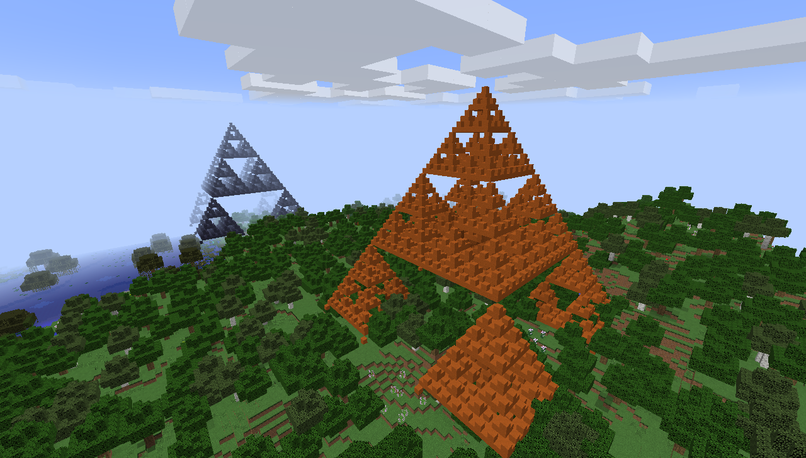

# bukkure-fractalz
Creating fractals in Minecraft using Clojure with the [Bukkure plugin](https://github.com/SevereOverfl0w/bukkure).

To generate these triangles connect a repl to a Spigot server running Bukkure and run the following function within the `fractalz.core` namespace :

```
(make-sierpinsky-pyramid 128 "<The name of your player>")
```

Or from within the Minecraft console run

```
  /sierpinsky 128
```

Replace 128 with the size of the triangle you want to create.


## Sierpinsky Pyramids



